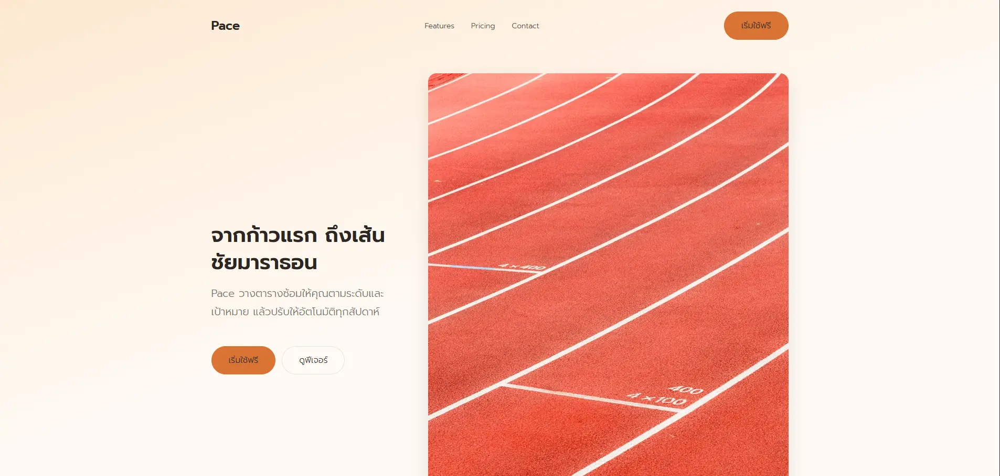

# Personal Portfolio

Portfolio website built with React and Vite — showcasing my projects, skills and certificates.

**🔗 Live:** https://puripat.vercel.app



## Features

- **Page switching without a router** — lightweight navigation using `useState` and conditional rendering
- **Responsive navbar** — collapses into a slide-out menu on mobile using `transform` + `opacity` (animatable, unlike `display`)
- **Data-driven content** — projects, skills and certificates all render from data files, so adding an entry means editing one array
- **Dark theme** — colours defined once as CSS custom properties in `:root`

## Tech Stack

| | |
|---|---|
| Framework | React 19 · Vite |
| Styling | CSS (custom properties, Flexbox, Grid) |
| Deployment | Vercel |

## Project Structure

```
src/
├── components/    Navbar · Hero · ProjectCard
├── pages/         Homepage · Skillpage · Contactpage
├── data/          projects.js · skills.js · certificates.js
└── App.jsx        page state + routing
```

## Running Locally

```bash
npm install
npm run dev
```
